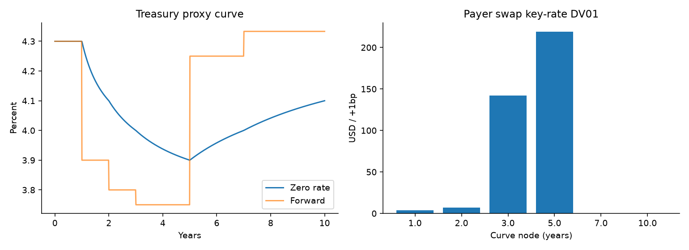
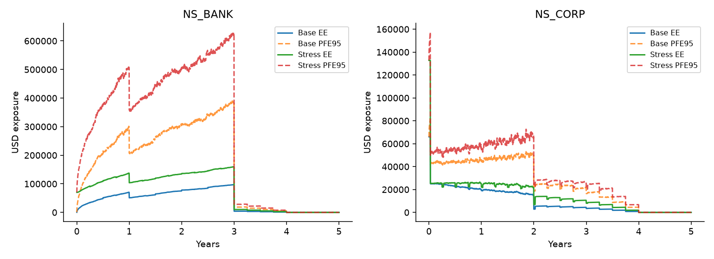
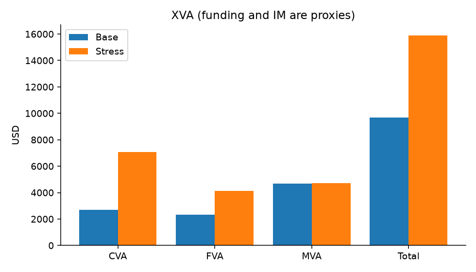

# Cross-Asset XVA & Exposure Engine

A compact Python project connecting a discount curve, one-factor Hull–White rates,
correlated equity/FX paths, derivative valuation, collateralised exposure and XVA.
The emphasis is on consistent pricing and testable assumptions, not production coverage.

```text
Zero-curve nodes → discount curve → Hull–White bond prices → swap/option/FX values
                                       ↑                           ↓
Historical correlation + option IV → correlated simulation → exposure → CVA
```

## Run it

Python 3.12 is the tested version. No API key or network access is needed for the demo.

```bash
python -m venv .venv
source .venv/bin/activate
pip install -r requirements-dev.txt
python -m pytest -q
python validate.py
python main.py
```

The default input is the **explicitly synthetic** `data/demo_market.json`, not a
silent fallback pretending to be market data. The run writes `output/results.json`
and three figures. `validate.py` writes a machine-readable pass/fail report and
exits nonzero if a pricing or martingale check fails.

To run with locally calibrated market inputs:

```bash
# Load DATABENTO_API_KEY and, preferably, FRED_API_KEY through your environment.
# This command may incur data charges; each uncached request is costed first.
python -m scripts.calibrate_market --asof 2026-09-20 --max-cost-usd 0.50
python validate.py --snapshot data/local_market.json --output output/live_validation.json
python main.py --snapshot data/local_market.json --output output/live
```

Market downloads, credentials and the derived local snapshot are excluded from Git.
See [data and calibration](docs/DATA.md) for quote selection and limitations.

## What is implemented

| Component | Implementation |
|---|---|
| Initial curve | Continuously compounded zero nodes; linear interpolation of log discount factors |
| Rates | One-factor Hull–White fitted to the initial curve; QuantLib conditional bond coefficients |
| Cross-asset dependence | Historical weekly rate changes and equity/FX log returns; 10% shrinkage to identity; Cholesky shocks |
| Equity/FX volatility | One maturity-relevant near-ATM European quote pair per asset; implied-volatility inversion, with FX futures-option proxy caveat |
| Products | Payer/receiver IRS, European equity/FX option, FX forward, simplified fixed-fixed cross-currency swap |
| Exposure | Netting, unilateral threshold/MTA collateral, calendar-day calls and explicit observation lag |
| Risk | Parallel and key-rate swap DV01, fixed-contract stresses with common random numbers |
| Validation | Pricing identities, independent bond expectation, martingales, grid/path checks, measured variance reduction |

### Rates and curve: the short explanation

For a zero rate `z(T)`, construct `P(0,T) = exp(-z(T) T)`. Between nodes,
interpolate `log P`. This keeps discount factors positive, allows negative rates,
and produces piecewise-constant instantaneous forwards. The first forward is
flat from time zero to the first node; extrapolation beyond the last node is rejected.

Rates have a random mean-reverting part and a deterministic curve-fitting part:

$$r_t=x_t+\phi(t),\qquad dx_t=-a x_t\,dt+\sigma_r\,dW_t^r.$$

`x` starts at zero. `phi` is derived from the input curve and model parameters,
not an independently assumed long-run rate. The simulation uses Euler steps for
`x`, trapezoidal integration of `x`, and the exact integral of the deterministic
shift. Daily steps plus contractual event dates are the default.

Future cashflows use **conditional bond prices based on the current state**, not
ratios containing future simulated discount factors. QuantLib supplies the
Hull–White bond coefficients; tests independently verify the Gaussian expectation.
The finite-grid simulation approximates the continuous model, with a separate
deterministic discretisation-bias test.

### Products and exposure

The payer IRS receives floating and pays fixed. At inception its par coupon is
`(1 - P(0,T)) / sum(accrual * P(0,payment))`. Thereafter it keeps the original
payment schedule, including final stubs, and the next floating coupon uses its
already-observed reset. Values are **after payments on that date**; settled trades
have zero remaining value and IM. Settled cash is not retained as trade exposure.

Equity drift is `r - dividend_yield`; FX drift is `r - foreign_rate`. The foreign
curve is deterministic and flat. European option valuation includes joint
rate/asset variance, matching the simulation model rather than inserting the
current short rate into a constant-rate Black–Scholes formula.

The example portfolio contains two four-year par swaps on different counterparties,
a one-year FX forward, a three-year fixed-fixed XCCY swap, and an equity call.
The call has 100 index units: this is a demo position size, not a claims engine
for exchange settlement conventions. The original contracts are held fixed
through a +100bp curve / 1.5× asset volatility / increased hazard stress.

The collateral engine uses `max(lagged MtM - threshold, 0)` and updates balances
only when the transfer exceeds MTA. A coarse grid that cannot resolve calls/lag
is rejected. This is a **lagged-collateral approximation**, not a full default
closeout/MPOR implementation. It excludes bilateral margin, remuneration,
business calendars and operational settlement disputes.

The historical `EPE` output key contains pointwise expected positive exposure
(an EE profile), not a time-averaged regulatory EPE measure. PFE95 is the 95th
percentile under the simulation measure, not a physical-measure forecast.

### XVA and variance reduction

CVA integrates `E[D(0,t) * positive_exposure(t)]` against marginal default
probabilities, with an independent constant hazard rate and fixed recovery.
Discount and exposure are multiplied **on each path before averaging**. FVA and
MVA are transparent funding-spread and schedule-IM proxies; their sum is an
illustrative total, not a production valuation adjustment stack.

Antithetic sampling is used in the exposure run; standard errors in validation
use independent **pair averages**. The existing equity option provides the
control-variate example: discounted terminal equity has a known expectation.
Its coefficient is fitted on a separate pilot sample. Common random numbers
couple base/bumped valuations. Reductions are measured, not asserted to be a
fixed percentage; see [validation results](docs/VALIDATION.md).

## Scope and limitations

- The live curve uses FRED **fitted Treasury zero yields**, not SOFR/OIS market
  instruments. This is discount-curve construction from supplied zeros, **not a
  deposit/futures/swap bootstrap**, and not multi-curve pricing.
- Mean reversion is assumed at `a = 0.05/year`; rate volatility is a historical
  weekly-change proxy. The rate model is curve-fitted, **not calibrated to an
  OTC swaption or cap/floor volatility surface**.
- Equity/FX inputs use single-expiry flat diffusion volatilities, not smiles or
  surfaces. FX futures/spot basis, asynchronous observations and long-maturity
  extrapolation are documented explicitly. Historical correlation is an estimate
  used as a pricing-model proxy, not implied correlation calibration.
- There is one rates factor, not a multi-factor rates model. SABR/ZABR,
  swaptions, caps/floors and CMS are outside this implementation.
- Simple year fractions and coupon schedules are used without holiday calendars,
  trade ageing before time zero or a separate cash-account ledger. Gaussian rates
  can be negative. Credit wrong-way risk and regulatory IM are not modelled.

## Code map and results

`curves.py` and `rates.py` provide the curve/model; `market_data.py` loads inputs;
`engine.py` simulates; `instruments.py` prices; `exposure.py` nets/collateralises;
`xva.py` integrates; `risk.py` computes sensitivities and sampling errors.

Start with the [short project defence](docs/INTERVIEW_GUIDE.md), then the
[test evidence](docs/VALIDATION.md). These figures are generated from the
**synthetic** default fixture, 2,000 paths and seed 42:




